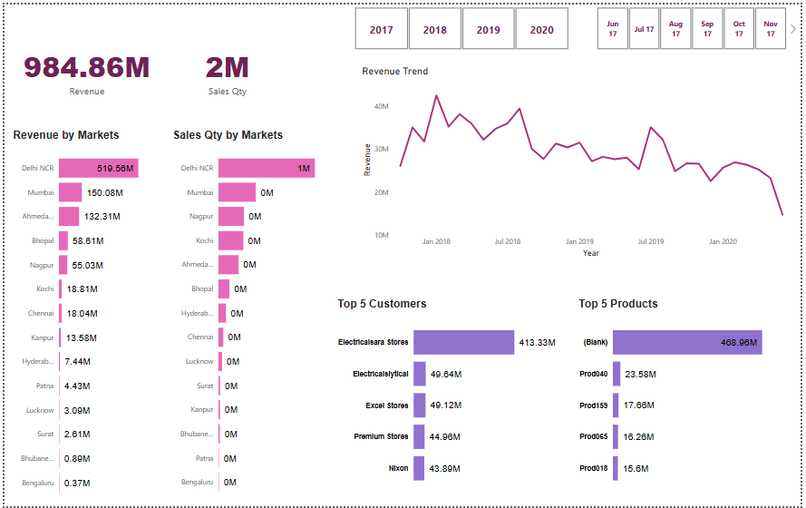
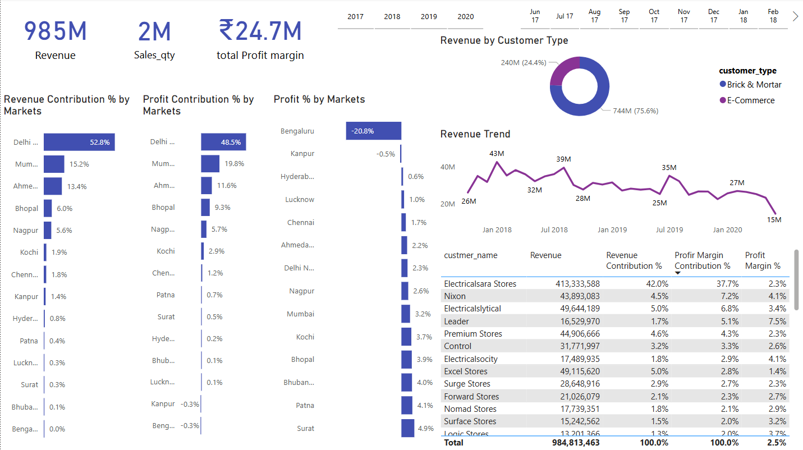
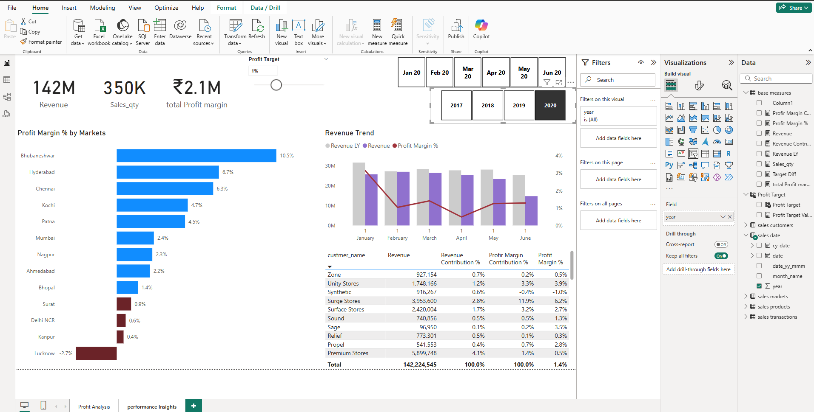

# 📊 Sales Insights Dashboard – SQL + Power BI

Welcome to my end-to-end data analysis project for **AtliQ Hardware**, where I’ve designed a full-stack sales insights dashboard using **MySQL** for data extraction and **Power BI** for transformation, modeling, and storytelling.

---

## 🎯 Project Objective

To help the sales leadership at AtliQ Hardware uncover hidden patterns in sales data, improve decision-making, and reduce manual reporting time through a dynamic, automated Power BI dashboard.

---

## 🌟 Project Highlights

- End-to-end pipeline: SQL (data extraction) → Power BI (ETL + Visualization)
- DAX-driven KPIs with dynamic profit margin targets
- Market-wise & customer-type performance comparisons
- Clean, interactive interface with slicers and flag-based indicators

---

## 🛠️ Tech Stack Used

- **SQL (MySQL)**: Data exploration, joins, aggregations
- **Power BI Desktop**: ETL with Power Query, star schema modeling, and visuals
- **DAX**: KPIs including revenue, margin %, and flagging underperformance
- **Power BI Service (Optional)**: Cloud publishing and dashboard sharing

---

## 🔄 Project Workflow

### 1. Data Discovery (SQL)
- Connected to a transactional database
- Used SQL to explore and validate data across:
  - `transactions`, `products`, `markets`, `customers`, and `date`

### 2. ETL & Transformation (Power Query)
- Removed duplicates and nulls
- Cleaned and normalized currency values
- Created calculated columns like Year-Month and Product Type
- Ensured appropriate data types and column naming conventions

### 3. Data Modeling
- Built a **Star Schema**:
  - Fact Table: `transactions`
  - Dimension Tables: `customers`, `products`, `markets`, `date`

### 4. Dashboard Design (Power BI)
- Key Metrics: Total Revenue, Sales Quantity, Profit Margin
- Visual elements:
  - Trendlines for revenue and margin over time
  - Market and customer segmentation
  - Flag logic for margin underperformance

---

## 🧩 Data Model Overview

**Tables Used**  
📁 `transactions`, `products`, `markets`, `customers`, `date`

**Custom DAX Measures**  
🧮 Revenue, Sales Quantity, Profit Margin %, Profit Margin Target Flag

---

## 📁 Project Structure

```bash
📦 PowerBI-Sales-Insights-Dashboard
├── 📊 SalesInsightsDashboard.pbix
├── 📁 SQL Queries/
│   ├── data_discovery.sql
│   └── data_joins.sql
├── 📁 Screenshots/
│   ├── Dashboard.png
│   ├── Profit_Analysis.png
│   └── Performance_Insights.png
├── 📄 README.md
```

---

## 📷 Dashboard Snapshots

### 📊 Main Dashboard Overview


### 💰 Profit Margin Analysis


### 🔍 Performance by Market & Customer


---

## 🔍 Key Insights & Takeaways

- Delhi NCR contributed over **50% of total revenue** but showed **low profit margins**
- Bhubaneshwar achieved a strong **10.5% profit margin** despite smaller revenue
- **Brick & Mortar** customers accounted for nearly **80% of all revenue**
- Profit Margin flag helped spotlight underperforming markets

---

## 🚀 Optimization Results

- Created dynamic margin targets using DAX
- Enabled revenue/margin analysis over time with trend visuals
- Improved reporting clarity for market and customer segmentation

---

## 📌 Business Recommendations

- Revisit pricing and cost structure in high-revenue, low-margin regions like Delhi NCR
- Promote high-margin zones like Bhubaneshwar through campaigns
- Encourage digital channel sales to diversify revenue beyond Brick & Mortar

---

## 🧠 Skills Demonstrated

- 📊 SQL for data prep and joining normalized tables
- 🧩 Power BI for modeling, visuals, and interactivity
- 🔢 DAX for advanced KPI logic and conditional flags
- 📈 Business storytelling via trendline and segment visuals

---

## 📬 Let’s Connect!

📧 mmeshram@umassd.edu  
🔗 https://www.linkedin.com/in/mayur-meshram9/

---

*Built with 💼 and 💡 using SQL + Power BI*
